# 🍒 CherryPicker - Smart Git Cherry-Picking in VS Code

**CherryPicker** helps you cherry-pick commits from pull requests across branches — directly inside **Visual Studio Code** — with zero need to touch the command line.

Supports **GitHub** and **Bitbucket** repositories. Fully OAuth-enabled. Intuitive. Clean. Fast.

---

## 🚀 Features

- ✅ OAuth login for GitHub and Bitbucket
- ✅ Fetch pull request commits with a PR number
- ✅ Select specific commits to cherry-pick
- ✅ Search for and validate target branches
- ✅ Perform cherry-pick across branches
- ✅ Detailed success, skip, and conflict messaging
- ✅ All within VS Code's side panel

---

## 🧭 How It Works

Absolutely — here's the updated section in your exact formatting style, reflecting the new automatic detection behavior:

---

### 1. **Authentication**

When you open the Cherry Picker panel:

- The extension **automatically detects the current Git repository** in your workspace.
- Based on the detected repo host (e.g., GitHub or Bitbucket), it will **display the appropriate provider button**.
- Click the shown button to authenticate via OAuth.
- A browser tab will open to request permissions.
- Once approved, you'll be redirected back to VS Code.

📸 **Initial View (Auto-Detected Provider)**

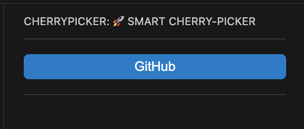

✅ **If successful**: You'll see a message like `Connected to GitHub`.

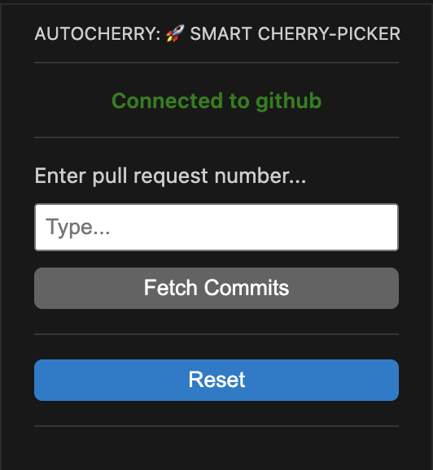

❌ **If authentication fails**: An error is shown below the button.

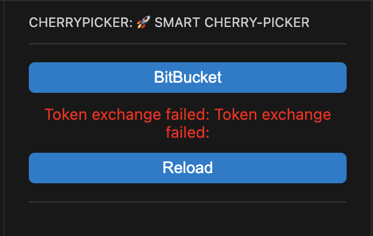

---

### 2. **Pull Request Fetch**

After authentication, the next section prompts:

- Enter the pull request number in the field labeled: **“Enter pull request number...”**

- Click **Fetch Commits**

📸 **Fetch PR UI**
✅ **Success**: Shows PR info and commits

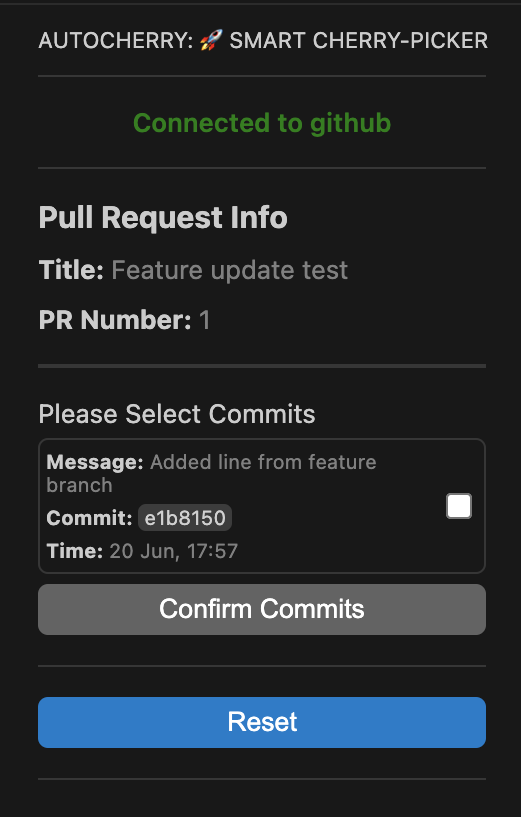

❌ **Failure**: Shows a red error message below the button.

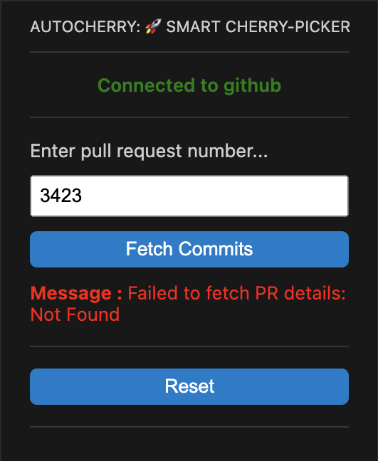

---

### 3. **Select Commits**

If commits are found:

- A list appears titled: **“Please Select Commits”**
- Each item includes:

  - 📝 Commit message
  - 🆔 SHA
  - 🕒 Time
  - ⬜ Checkbox to select

📸 **Commit List**

Click **Confirm Commits** to move forward.

---

### 4. **Target Branch Selection**

Now you’ll see:

- A list of selected commits under **“Selected Commits”**
- A new input: **“Enter branch name...”** and a **Search** button

📸 **Selected Commits View**

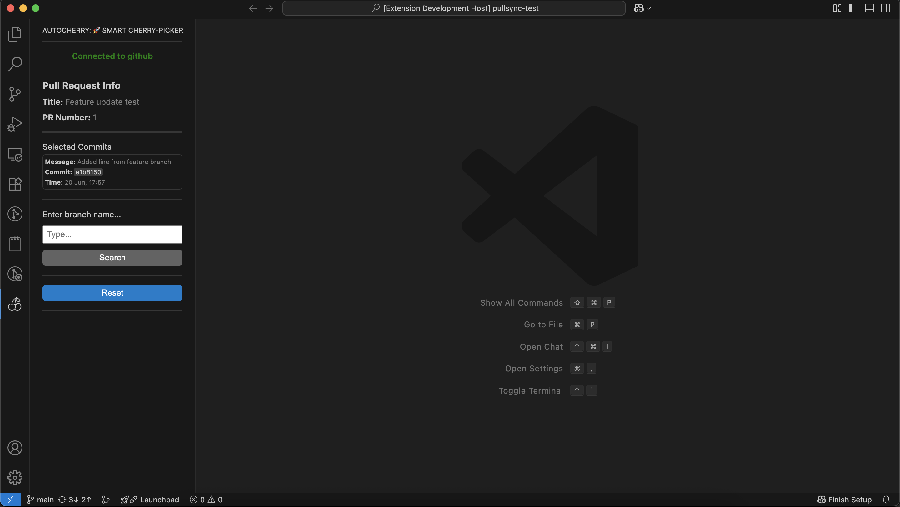

✅ If branch exists and is valid:

- Info appears like: `Target Branch: new-ship-int-hotfix`

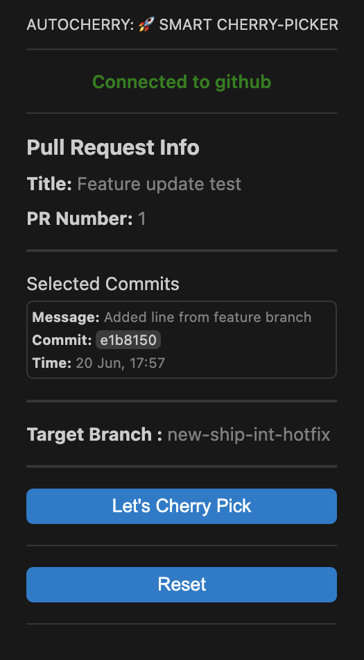

❌ If not found or already merged:

- An error is shown.

📸 **Branch Not Found / Error Example**

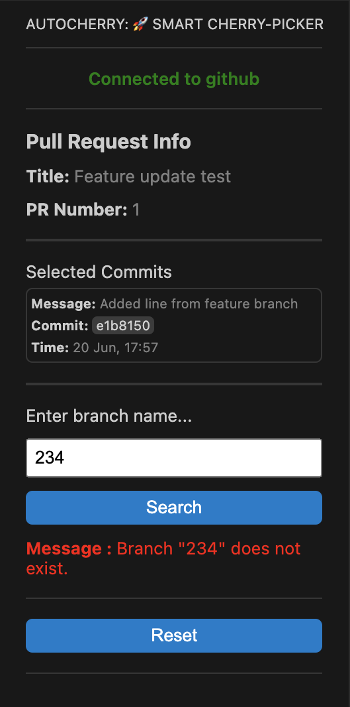

---

### 5. **Cherry-Pick Execution**

Once the target branch is found:

- Click **Let’s cherry pick** to begin
- Results will vary depending on outcome:

#### ✅ **Success: Commits Pushed**

Shows how many commits were cherry-picked and a link to the branch.

📸
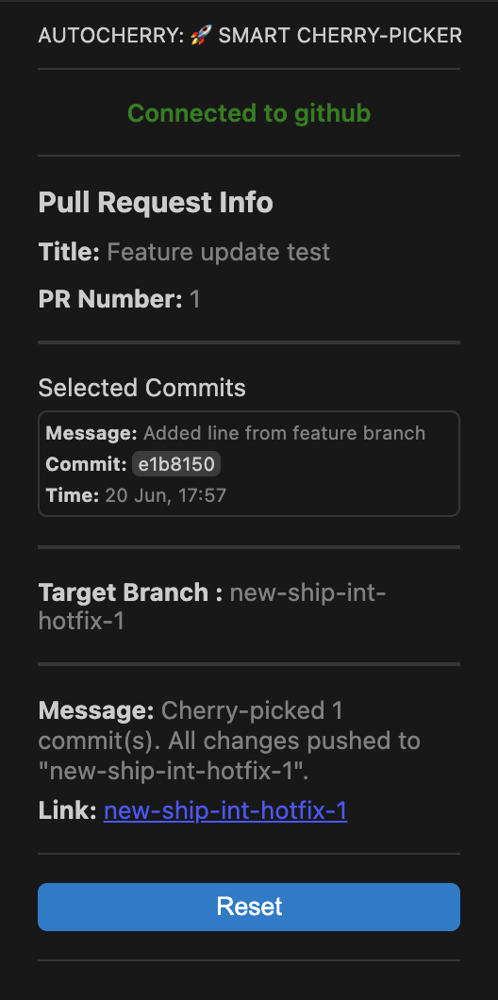

#### 🔁 **Skipped: Duplicates**

If some commits already exist, they’ll be skipped.

📸
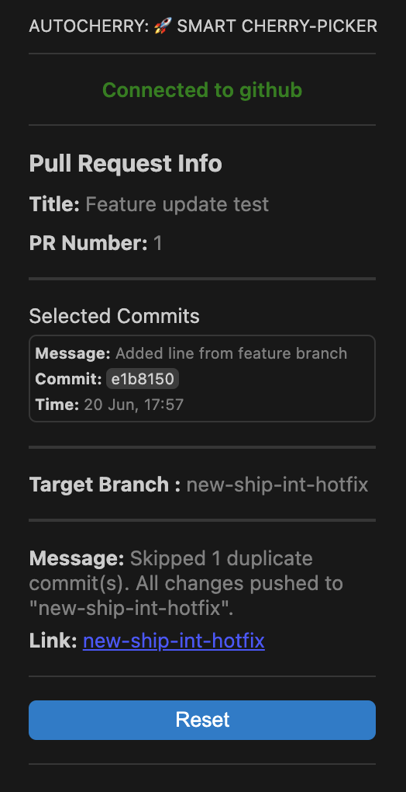

#### ❌ **Merge Conflict**

If a conflict occurs, an error message appears.

📸
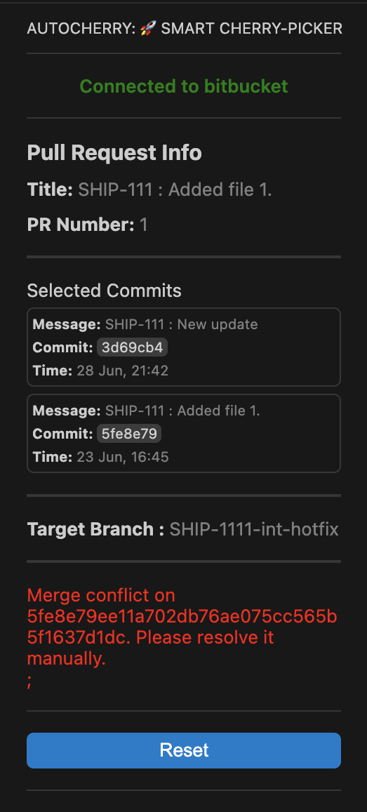

---
